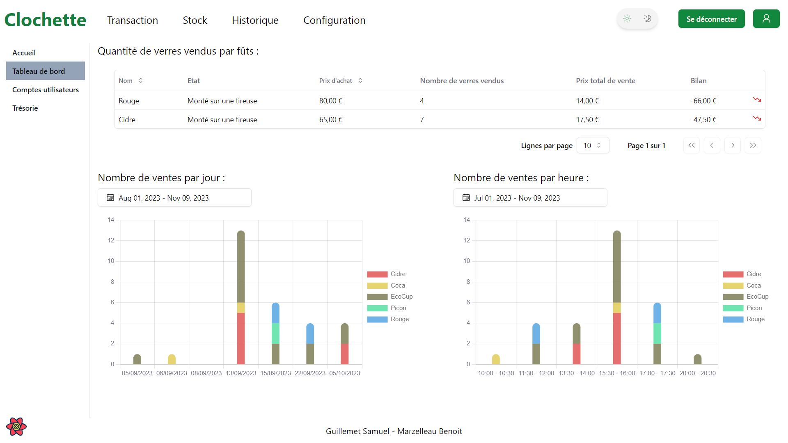

# Clochette

[](https://codecov.io/github/Clochette-AbsINThe/clochette)
[](https://github.com/Clochette-AbsINThe/clochette/actions/workflows/release-on-push.yml)

Site Web pour la gestion du bar Absinthe de TSP

---





---

## Documentation

### Backend

- [API Documentation](./backend/README.md)
- [Architecture](./backend/docs/architecture.md)
- [Details about the v2 api (Optional)](./backend/docs/details.md)

### Frontend

- [Instruction for development of frontend](./frontend/Readme.md)

### Docker

- [Docker](./docker/Readme.md)
- [SSL details](./docker/reverse-proxy/ssl/README.md)

## Installation

There is 2 ways to install the project:

- Using docker compose, which is the closest to the production environment, you will need to setup the SSL part (go see the [SSL details](./docker/reverse-proxy/ssl/README.md) for more information)

- Using poetry, which is the easiest way to install the project, but you will need to install poetry to be able to run the backend.

### Using docker compose

#### Requirements

- docker

#### Installation

You need to setup the `.env` file in the `/docker` folder to setup the environment variables. You can check this [.env.sample](./docker/.env.sample) file which should be working for development.

Then, you can run the following command to start the project:

```bash
$ ./DeployDocker.sh
```

Run with `-h`, `--help` or `help` to see the help.

For example, if you want to initialize the database, you can run the following command:

```bash
$ ./DeployDocker.sh init
```

Go to https://clochette.dev to see the website.
You can also go to https://clochette.dev/api/v1/docs to see the API documentation.

### Using poetry

#### Requirements

- Python >=3.10
- Poetry
- Node >=16

#### Installation

##### Backend

Poetry will take all the information on the `pyproject.toml` file and will install all its dependencies.
Go check the backend [README](./backend/README.md) for more information.

If you have poetry installed, you can run the following command to install the dependencies:

```bash
$ poetry install
```

##### Frontend

Install the dependencies:

```bash
$ npm install
```

Create a `.env.development` file in the frontend folder. You can check this [.env.sample](./frontend/.env.sample) file which should be working for development.

#### Running

##### Backend

You can run the backend using the following command:

```bash
$ poetry run uvicorn app.main:app --reload
```

Be sure to be in the backend folder.

You will maybe need to run the following command to migrate the database:

```bash
$ poetry run python app/command.py init --bypass-revision
```

You will find the documentation of the API at the following address: http://localhost:8000/docs

##### Frontend

You can run the frontend using the following command:

```bash
$ npm run dev
```

Be sure to be in the frontend folder.

Visit http://localhost:3000 to see the website.

Connect using the following credentials:

- Username: `admin`
- Password: `admin-password*45`
